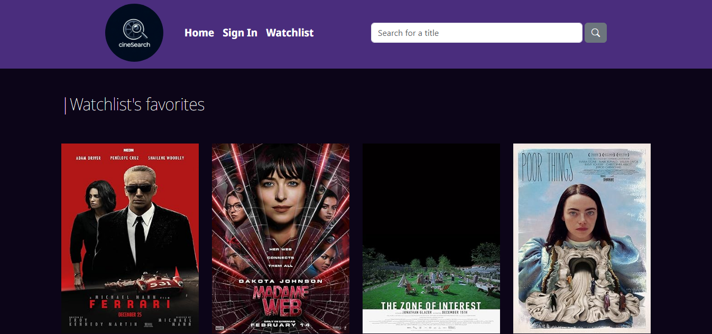
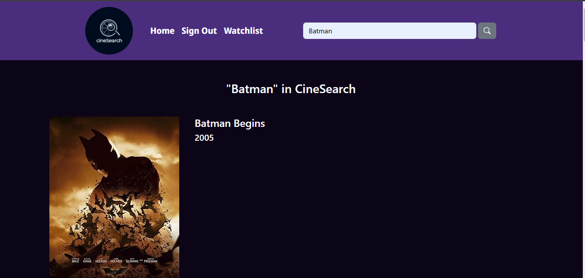
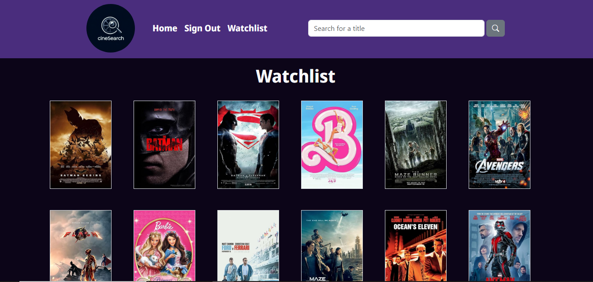
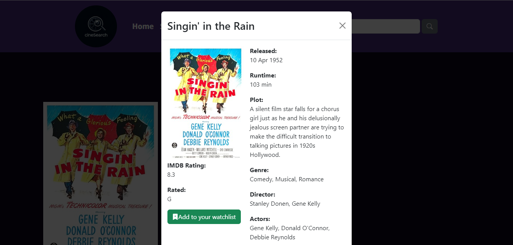

# 🎥 CineSearch

CineSearch is a web application developed to help users create and manage a watchlist of movies. The application uses the OMDB API to fetch movie information.

    

        
        
    

    

        
        
    

## 🛠️ Technologies Used

- **Front-end**: Angular
- **Back-end**: Spring Boot
- **Database**: MySQL
- **Movie API**: OMDB API

## ✨ Features

- 🔍 Search movies by title
- ➕ Add movies to watchlist
- 📄 View movie details
- 🗑️ Remove movies from watchlist

## 📋 Requirements

- Node.js
- Angular CLI
- Java
- Maven
- MySQL

## 📄 License

This project is licensed under the MIT License 
